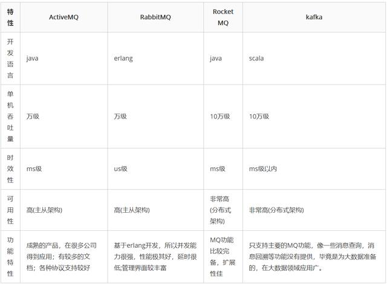

[TOC]

# Kafka之拒绝挖坑

入库+预警

他们原本是文件入库

削峰填谷

## 为什么选用Kafka

## **三、Kafka、RocketMQ、RabbitMQ比较** 

****


## **1.ActiveMQ** 

**优点**

- 单机吞吐量：万级
- topic数量都吞吐量的影响：
- 时效性：ms级
- 可用性：高，基于主从架构实现高可用性
- 消息可靠性：有较低的概率丢失数据
- 功能支持：MQ领域的功能极其完备

**缺点:**


官方社区现在对ActiveMQ 5.x维护越来越少，较少在大规模吞吐的场景中使用。


## **2.Kafka** 

号称大数据的杀手锏，谈到大数据领域内的消息传输，则绕不开Kafka，这款为大数据而生的消息中间件，以其百万级TPS的吞吐量名声大噪，迅速成为大数据领域的宠儿，在数据采集、传输、存储的过程中发挥着举足轻重的作用。

Apache Kafka它最初由LinkedIn公司基于独特的设计实现为一个分布式的提交日志系统( a distributed commit log)，之后成为Apache项目的一部分。

目前已经被LinkedIn，Uber, Twitter, Netflix等大公司所采纳。


**优点**

- 性能卓越，单机写入TPS约在百万条/秒，最大的优点，就是吞吐量高。
- 时效性：ms级
- 可用性：非常高，kafka是分布式的，一个数据多个副本，少数机器宕机，不会丢失数据，不会导致不可用
- 消费者采用Pull方式获取消息, 消息有序, 通过控制能够保证所有消息被消费且仅被消费一次;
- 有优秀的第三方Kafka Web管理界面Kafka-Manager；
- 在日志领域比较成熟，被多家公司和多个开源项目使用；
- 功能支持：功能较为简单，主要支持简单的MQ功能，在大数据领域的实时计算以及日志采集被大规模使用

**缺点：**

1. Kafka单机超过64个队列/分区，Load会发生明显的飙高现象，队列越多，load越高，发送消息响应时间变长
2. 使用短轮询方式，实时性取决于轮询间隔时间；
3. 消费失败不支持重试；
4. 支持消息顺序，但是一台代理宕机后，就会产生消息乱序；
5. 社区更新较慢；

## **3.RabbitMQ** 

RabbitMQ 2007年发布，是一个在AMQP(高级消息队列协议)基础上完成的，可复用的企业消息系统，是当前最主流的消息中间件之一。


**RabbitMQ优点**：

1. 由于erlang语言的特性，mq 性能较好，高并发；
2. 吞吐量到万级，MQ功能比较完备
3. 健壮、稳定、易用、跨平台、支持多种语言、文档齐全；
4. 开源提供的管理界面非常棒，用起来很好用
5. 社区活跃度高；

**RabbitMQ缺点：**

1. erlang开发，很难去看懂源码，基本职能依赖于开源社区的快速维护和修复bug，不利于做二次开发和维护。
2. RabbitMQ确实吞吐量会低一些，这是因为他做的实现机制比较重。
3. 需要学习比较复杂的接口和协议，学习和维护成本较高。

## **4.RocketMQ** 

RocketMQ出自 阿里公司的开源产品，用 Java 语言实现，在设计时参考了 Kafka，并做出了自己的一些改进。

RocketMQ在阿里集团被广泛应用在订单，交易，充值，流计算，消息推送，日志流式处理，binglog分发等场景。


**RocketMQ优点：**

1. 单机吞吐量：十万级
2. 可用性：非常高，分布式架构
3. 消息可靠性：经过参数优化配置，消息可以做到0丢失
4. 功能支持：MQ功能较为完善，还是分布式的，扩展性好
5. 支持10亿级别的消息堆积，不会因为堆积导致性能下降
6. 源码是java，我们可以自己阅读源码，定制自己公司的MQ，可以掌控

**RocketMQ缺点：**

1. 支持的客户端语言不多，目前是java及c++，其中c++不成熟；
2. 社区活跃度一般
3. 没有在 mq 核心中去实现JMS等接口，有些系统要迁移需要修改大量代码

## Kafka数据丢失？

### 数据丢失是一件非常严重的事情事，针对数据丢失的问题我们需要有明确的思路来确定问题所在，针对这段时间的总结，我个人面对kafka 数据丢失问题的解决思路如下：

- 是否真正的存在数据丢失问题，比如有很多时候可能是其他同事操作了测试环境，所以首先确保数据没有第三方干扰。
- 理清你的业务流程，数据流向，数据到底是在什么地方丢失的数据，在kafka 之前的环节或者kafka之后的流程丢失？比如kafka的数据是由flume提供的，也许是flume丢失了数据，kafka 自然就没有这一部分数据。
- 如何发现有数据丢失，又是如何验证的。从业务角度考虑，例如：教育行业，每年高考后数据量巨大，但是却反常的比高考前还少，或者源端数据量和目的端数据量不符
- 定位数据是否在kafka之前就已经丢失还事消费端丢失数据的

1. kafka支持数据的重新回放功能(换个消费group)，清空目的端所有数据，重新消费。
2. 如果是在消费端丢失数据，那么多次消费结果完全一模一样的几率很低。
3. 如果是在写入端丢失数据，那么每次结果应该完全一样(在写入端没有问题的前提下)。

- kafka环节丢失数据，常见的kafka环节丢失数据的原因有：

1. 如果auto.commit.enable=true，当consumer fetch了一些数据但还没有完全处理掉的时候，刚好到commit interval出发了提交offset操作，接着consumer crash掉了。这时已经fetch的数据还没有处理完成但已经被commit掉，因此没有机会再次被处理，数据丢失。

2. 网络负载很高或者磁盘很忙写入失败的情况下，没有自动重试重发消息。没有做限速处理，超出了网络带宽限速。kafka一定要配置上消息重试的机制，并且重试的时间间隔一定要长一些，默认1秒钟并不符合生产环境（网络中断时间有可能超过1秒）。

3. 如果磁盘坏了，会丢失已经落盘的数据

4. 单批数据的长度超过限制会丢失数据，报kafka.common.MessageSizeTooLargeException异常
   解决：

   ```
   Consumer side:fetch.message.max.bytes- this will determine the largest size of a message that can be fetched by the consumer.
   
   Broker side:replica.fetch.max.bytes- this will allow for the replicas in the brokers to send messages within the cluster and make sure the messages are replicated correctly. If this is too small, then the message will never be replicated, and therefore, the consumer will never see the message because the message will never be committed (fully replicated).
   
   Broker side:message.max.bytes- this is the largest size of the message that can be received by the broker from a producer.
   
   Broker side (per topic):max.message.bytes- this is the largest size of the message the broker will allow to be appended to the topic. This size is validated pre-compression. (Defaults to broker'smessage.max.bytes.)
   ```

5. partition leader在未完成副本数follows的备份时就宕机的情况，即使选举出了新的leader但是已经push的数据因为未备份就丢失了！
   kafka是多副本的，当你配置了同步复制之后。多个副本的数据都在PageCache里面，出现多个副本同时挂掉的概率比1个副本挂掉的概率就很小了。（官方推荐是通过副本来保证数据的完整性的）

6. kafka的数据一开始就是存储在PageCache上的，定期flush到磁盘上的，也就是说，不是每个消息都被存储在磁盘了，如果出现断电或者机器故障等，PageCache上的数据就丢失了。
   可以通过log.flush.interval.messages和log.flush.interval.ms来配置flush间隔，interval大丢的数据多些，小会影响性能但在0.8版本，可以通过replica机制保证数据不丢，代价就是需要更多资源，尤其是磁盘资源，kafka当前支持GZip和Snappy压缩，来缓解这个问题 是否使用replica取决于在可靠性和资源代价之间的balance

同时kafka也提供了相关的配置参数，来让你在性能与可靠性之间权衡（一般默认）：

#### 当达到下面的消息数量时，会将数据flush到日志文件中。默认10000

log.flush.interval.messages=10000

#### 当达到下面的时间(ms)时，执行一次强制的flush操作。interval.ms和interval.messages无论哪个达到，都会flush。默认3000ms

log.flush.interval.ms=1000

#### 检查是否需要将日志flush的时间间隔

log.flush.scheduler.interval.ms = 3000

### Kafka的优化建议

#### producer端：

- 设计上保证数据的可靠安全性，依据分区数做好数据备份，设立副本数等。
  push数据的方式：同步异步推送数据：权衡安全性和速度性的要求，选择相应的同步推送还是异步推送方式，当发现数据有问题时，可以改为同步来查找问题。
- flush是kafka的内部机制,kafka优先在内存中完成数据的交换,然后将数据持久化到磁盘.kafka首先会把数据缓存(缓存到内存中)起来再批量flush.
  可以通过log.flush.interval.messages和log.flush.interval.ms来配置flush间隔
- 可以通过replica机制保证数据不丢.
  代价就是需要更多资源,尤其是磁盘资源,kafka当前支持GZip和Snappy压缩,来缓解这个问题
  是否使用replica(副本)取决于在可靠性和资源代价之间的balance(平衡)
- broker到 Consumer kafka的consumer提供两种接口.

1. high-level版本已经封装了对partition和offset的管理，默认是会定期自动commit offset，这样可能会丢数据的
2. low-level版本自己管理spout线程和partition之间的对应关系和每个partition上的已消费的offset(定期写到zk)
   并且只有当这个offset被ack后，即成功处理后，才会被更新到zk，所以基本是可以保证数据不丢的即使spout线程crash(崩溃)，重启后还是可以从zk中读到对应的offset

- 异步要考虑到partition leader在未完成副本数follows的备份时就宕机的情况，即使选举出了新的leader但是已经push的数据因为未备份就丢失了！

1. 不能让内存的缓冲池太满，如果满了内存溢出，也就是说数据写入过快，kafka的缓冲池数据落盘速度太慢，这时肯定会造成数据丢失。
2. 尽量保证生产者端数据一直处于线程阻塞状态，这样一边写内存一边落盘。
3. 异步写入的话还可以设置类似flume回滚类型的batch数，即按照累计的消息数量，累计的时间间隔，累计的数据大小设置batch大小。

- 设置合适的方式，增大batch 大小来减小网络IO和磁盘IO的请求，这是对于kafka效率的思考。

1. 不过异步写入丢失数据的情况还是难以控制
2. 还是得稳定整体集群架构的运行，特别是zookeeper，当然正对异步数据丢失的情况尽量保证broker端的稳定运作吧

kafka不像hadoop更致力于处理大量级数据，kafka的消息队列更擅长于处理小数据。针对具体业务而言，若是源源不断的push大量的数据（eg：网络爬虫），可以考虑消息压缩。但是这也一定程度上对CPU造成了压力,还是得结合业务数据进行测试选择

- 结合上游的producer架构，

### broker端：

topic设置多分区，分区自适应所在机器，为了让各分区均匀分布在所在的broker中，分区数要大于broker数。分区是kafka进行并行读写的单位，是提升kafka速度的关键。

1. broker能接收消息的最大字节数的设置一定要比消费端能消费的最大字节数要小，否则broker就会因为消费端无法使用这个消息而挂起。
2. broker可赋值的消息的最大字节数设置一定要比能接受的最大字节数大，否则broker就会因为数据量的问题无法复制副本，导致数据丢失

### comsumer端：

关闭自动更新offset，等到数据被处理后再手动跟新offset。
在消费前做验证前拿取的数据是否是接着上回消费的数据，不正确则return先行处理排错。
一般来说zookeeper只要稳定的情况下记录的offset是没有问题，除非是多个consumer group 同时消费一个分区的数据，其中一个先提交了，另一个就丢失了。

------

问题：
kafka的数据一开始就是存储在PageCache上的，定期flush到磁盘上的，也就是说，不是每个消息都被存储在磁盘了，如果出现断电或者机器故障等，PageCache上的数据就丢失了。

这个是总结出的到目前为止没有发生丢失数据的情况

```
//producer用于压缩数据的压缩类型。默认是无压缩。正确的选项值是none、gzip、snappy。压缩最好用于批量处理，批量处理消息越多，压缩性能越好
     props.put("compression.type", "gzip");
     //增加延迟
     props.put("linger.ms", "50");
     //这意味着leader需要等待所有备份都成功写入日志，这种策略会保证只要有一个备份存活就不会丢失数据。这是最强的保证。，
     props.put("acks", "all");
     //无限重试，直到你意识到出现了问题，设置大于0的值将使客户端重新发送任何数据，一旦这些数据发送失败。注意，这些重试与客户端接收到发送错误时的重试没有什么不同。允许重试将潜在的改变数据的顺序，如果这两个消息记录都是发送到同一个partition，则第一个消息失败第二个发送成功，则第二条消息会比第一条消息出现要早。
     props.put("retries ", MAX_VALUE);
     props.put("reconnect.backoff.ms ", 20000);
     props.put("retry.backoff.ms", 20000);
     
     //关闭unclean leader选举，即不允许非ISR中的副本被选举为leader，以避免数据丢失
     props.put("unclean.leader.election.enable", false);
     //关闭自动提交offset
     props.put("enable.auto.commit", false);
     限制客户端在单个连接上能够发送的未响应请求的个数。设置此值是1表示kafka broker在响应请求之前client不能再向同一个broker发送请求。注意：设置此参数是为了避免消息乱序
     props.put("max.in.flight.requests.per.connection", 1);
```

## Kafka重复数据？

- 重复消息是怎么回事？为何会产生重复消息
  1. 消息生产者把消息发给消息队列，是否接收到消息，生产者需要一个应答的(这里出问题，生产者未收到返回消息，就会重试)
  2. 消息队列收到消息后，因为负载高，相应变慢，当消息队列试图把消息发回给生产者的时候，生产者那边已经超时，又会发送
  3. 生产者发送消息后，生产者与消息队列之间的网络通讯出现问题了
  4. 消息从消息队列往消费者投递时产生了重复消息(消息队列给了消费者，但是消费者还没来得及应答消息队列，消息队列重试产生重复数据)
  5. 消息队列收到了消费者的应答，但是投递状态更新失败也会产生重复消息


- 重复消息带来的问题和如何解决重复消息

  解决重复消息采用幂等操作

  > update table_A set count = 10 where id = 1; //幂等
  >
  > update table_A set count = count + 1 where id = 1; //不幂等

  幂等操作有三种解决方式

  1. 乐观锁(消息在进行数据更新的时候带上数据的版本号，每个版本号只有一次执行成功的机会，如果失败生产者需要重新获取最新的版本号)
  2. 去重表，利用数据库表单的特性来实现去重（构建一个唯一性的索引），对于关系型有用


## 其他解决方案

## 如何防止数据丢失

生产者：同步发送消息，且消息配置为-1或all，leader分区和所有follwer都写到磁盘里。

异步模式下，为防止缓冲区满，可以在配置文件设置不限制阻塞超时时间，当缓冲区满时让生产者一直处于阻塞状态。

生产者：手动提交，即读取到消息后，确认消息消费完毕，才手动提交offset。但是要避免逻辑处理时间过长，导致连接超时，会使消息重复消费。

故kafka一定要配置上消息重试的机制，并且重试的时间间隔一定要长一些，默认1秒钟并不符合生产环境（网络中断时间有可能超过1秒）。
增加如下参数会较大幅度的减少kafka写入数据照成的数据丢失，在公司实测，目前还没遇到数据丢失的情况。

### 生产端

设计上保证数据的可靠安全性，依据分区数做好数据备份，设立副本数等。
push数据的方式：同步异步推送数据：权衡安全性和速度性的要求，选择相应的同步推送还是异步推送方式，当发现数据有问题时，可以改为同步来查找问题。

flush是kafka的内部机制,kafka优先在内存中完成数据的交换,然后将数据持久化到磁盘.kafka首先会把数据缓存(缓存到内存中)起来再批量flush.
可以通过log.flush.interval.messages和log.flush.interval.ms来配置flush间隔

可以通过replica机制保证数据不丢.
代价就是需要更多资源,尤其是磁盘资源,kafka当前支持GZip和Snappy压缩,来缓解这个问题
是否使用replica(副本)取决于在可靠性和资源代价之间的balance(平衡)

broker到 Consumer kafka的consumer提供两种接口.
high-level版本已经封装了对partition和offset的管理，默认是会定期自动commit offset，这样可能会丢数据的

low-level版本自己管理spout线程和partition之间的对应关系和每个partition上的已消费的offset(定期写到zk)
并且只有当这个offset被ack后，即成功处理后，才会被更新到zk，所以基本是可以保证数据不丢的即使spout线程crash(崩溃)，重启后还是可以从zk中读到对应的offset

异步要考虑到partition leader在未完成副本数follows的备份时就宕机的情况，即使选举出了新的leader但是已经push的数据因为未备份就丢失了！
不能让内存的缓冲池太满，如果满了内存溢出，也就是说数据写入过快，kafka的缓冲池数据落盘速度太慢，这时肯定会造成数据丢失。
尽量保证生产者端数据一直处于线程阻塞状态，这样一边写内存一边落盘。
异步写入的话还可以设置类似flume回滚类型的batch数，即按照累计的消息数量，累计的时间间隔，累计的数据大小设置batch大小。
设置合适的方式，增大batch 大小来减小网络IO和磁盘IO的请求，这是对于kafka效率的思考。
不过异步写入丢失数据的情况还是难以控制
还是得稳定整体集群架构的运行，特别是zookeeper，当然正对异步数据丢失的情况尽量保证broker端的稳定运作吧

```
设置同步模式, producer.type = sync, Request.required.acks =  -1, replication.factor >= 2 且 min.insync.replicas >= 2
1
```

### broker端：

topic设置多分区，分区自适应所在机器，为了让各分区均匀分布在所在的broker中，分区数要大于broker数。分区是kafka进行并行读写的单位，是提升kafka速度的关键。

broker能接收消息的最大字节数的设置一定要比消费端能消费的最大字节数要小，否则broker就会因为消费端无法使用这个消息而挂起。

broker可赋值的消息的最大字节数设置一定要比能接受的最大字节数大，否则broker就会因为数据量的问题无法复制副本，导致数据丢失

### 消费端

```
		//producer用于压缩数据的压缩类型。默认是无压缩。正确的选项值是none、gzip、snappy。压缩最好用于批量处理，批量处理消息越多，压缩性能越好
     props.put("compression.type", "gzip");
     //增加延迟
     props.put("linger.ms", "50");
     //这意味着leader需要等待所有备份都成功写入日志，这种策略会保证只要有一个备份存活就不会丢失数据。这是最强的保证。，
     props.put("acks", "all");
     //无限重试，直到你意识到出现了问题，设置大于0的值将使客户端重新发送任何数据，一旦这些数据发送失败。注意，这些重试与客户端接收到发送错误时的重试没有什么不同。允许重试将潜在的改变数据的顺序，如果这两个消息记录都是发送到同一个partition，则第一个消息失败第二个发送成功，则第二条消息会比第一条消息出现要早。
     props.put("retries ", MAX_VALUE);
     props.put("reconnect.backoff.ms ", 20000);
     props.put("retry.backoff.ms", 20000);
     
     //关闭unclean leader选举，即不允许非ISR中的副本被选举为leader，以避免数据丢失
     props.put("unclean.leader.election.enable", false);
     //关闭自动提交offset
     props.put("enable.auto.commit", false);
     限制客户端在单个连接上能够发送的未响应请求的个数。设置此值是1表示kafka broker在响应请求之前client不能再向同一个broker发送请求。注意：设置此参数是为了避免消息乱序
     props.put("max.in.flight.requests.per.connection", 1);
1234567891011121314151617
```

topic设置多分区，分区自适应所在机器，为了让各分区均匀分布在所在的broker中，分区数要大于broker数。分区是kafka进行并行读写的单位，是提升kafka速度的关键。

如果处理耗时很长，则建议把逻辑放到另一个线程中去做。为了避免数据丢失，有两点建议：

enable.auto.commit=false 关闭自动提交位移

在消息被完整处理之后再手动提交位移

## 消息重复解决方案

针对消息重复：将消息的唯一标识保存到外部介质中，每次消费时判断是否处理过即可。比如redis中

消息可以使用唯一id标识

生产者（ack=all 代表至少成功发送一次)

消费者 （offset手动提交，业务逻辑成功处理后，提交offset）

落表（主键或者唯一索引的方式，避免重复数据）

业务逻辑处理（选择唯一主键存储到Redis或者mongdb中，先查询是否存在，若存在则不处理；若不存在，先插入Redis或Mongdb,再进行业务逻辑处理）

新版本的API在平衡的时候可以注册一个对象，在平衡前和后可以调用这个对象的方法，我们在这个方法里面将此topic的stream提交（这可能会造成数据丢失，因为这些数据很可能还没处理），

这个新API测试了下，基本没什么问题。
高级API如何解决？用类分布式锁最终解决了这个问题，实现思路比较简单，就是通过ZK来实现，程序启动前先定义好需要启动的消费者数量，如果还没达到这个量，线程都不能启动，达到这个线程数后，休眠几秒后启动，在启动的时候，消费者线程已经得到了平衡，除非线程死掉否则不会发生平衡了，所以暂时解决了这个问题。
思路共享出来，希望对大家有所帮助。

这里需要 HW ( HighWartermark ) 的协同配合。类似于木桶原理，水位取决于最低那块短板

某个 topic 的某 partition 有三个副本，分别为 A、B、C。A 作为 leader 肯定是 LEO 最高，B 紧随其后，C 机器由于配置比较低，网络比较差，故而同步最慢。这个时候 A 机器宕机，这时候如果 B 成为 leader，假如没有 HW，在 A 重新恢复之后会做同步(makeFollower) 操作，在宕机时 log 文件之后直接做追加操作，而假如 B 的 LEO 已经达到了 A 的 LEO，会产生数据不一致的情况

leader epoch

1500 * 1500

10023 项目名称：A QT Latex Editor
详细介绍：用QT实现一个所见即所得的Latex编辑器，能够在图形化界面的IDE里面，采用类似Word的方式，所见即所得书写文档，生成Latex语法的源文件（.tex文件）。将此文件传递到服务器端，保存到数据库中，编译成pdf文件返回客户端显示。 支持在本地打开存储在服务器端数据库的文档进行继续编辑。
使用语言：qt（当然搭建服务器可以用node
截止日期：2019年5月31日
预期达到的效果：能够获得.tex文件和pdf文件，支持生成复杂公式
重点强调：附加讲解工作，就是程序解读以及使用说明

### pull & push

