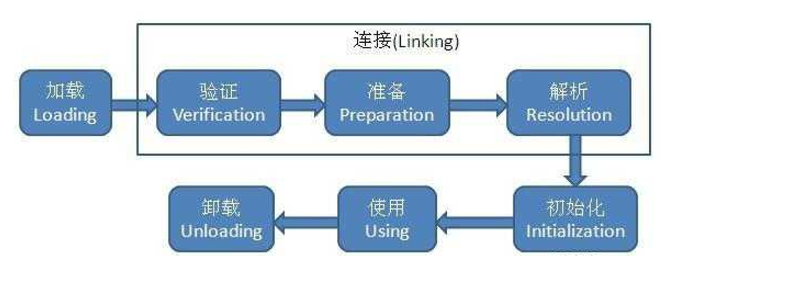
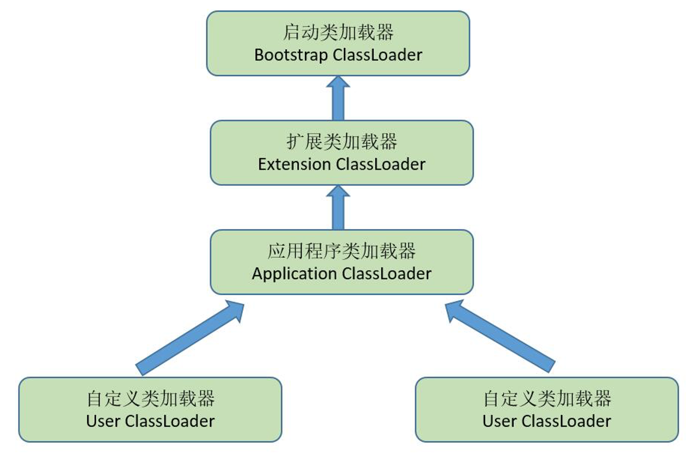

## 类加载机制和双亲委派模型

- 加载：找到类，把它从文件或者字节流转换为JVM中内存中存在的对象
- 验证：检查jar文件对应的class文件所对应字节流包含信息是否符合虚拟机要求
- 准备：为类变量(static)分配内存设置初始值(固定)
- 解析：将常量的一些引用替换为实际值的过程
- 初始化：类加载的最后过程，真正执行类中的java程序代码

类加载器包括：

1. 启动类加载器:存放在<JAVA_HOME>\lib目录中的，并且是虚拟机识别的类库加载到虚拟机内存中
2. 扩展类加载器:存放在<JAVA_HOME>\lib\ext目录中的所有类库，开发者可以直接使用；
3. 应用程序加载器(默认类加载器):加载用户类路径上指定的类库，开发者可以直接使用

**双亲委派模型(加载器之间的关系)**

> 某个特定的类加载器在接到加载类的请求时，首先将加载任务委托给父类加载器，依次递归，如果父类加载器可以完成类加载任务，就成功返回；只有父类加载器无法完成此加载任务时，才自己去加载。

Java类随着它的类加载器一起具备了带有优先级的层次关系，保证java程序稳定运行