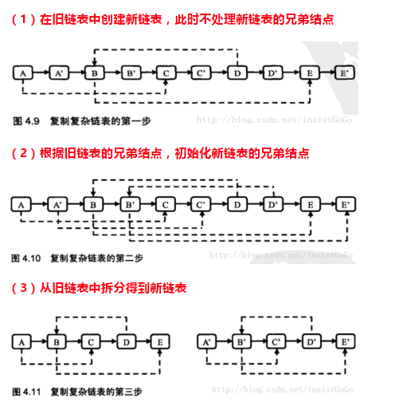

**题目描述**
输入一个复杂链表（每个节点中有节点值，以及两个指针，一个指向下一个节点，另一个特殊指针指向任意一个节点），返回结果为复制后复杂链表的head。（注意，输出结果中请不要返回参数中的节点引用，否则判题程序会直接返回空）

**题解**

这道题看完之后完全没有思路 注意二刷

转思路



```
/*
*解题思路：
*1、遍历链表，复制每个结点，如复制结点A得到A1，将结点A1插到结点A后面；
*2、重新遍历链表，复制老结点的随机指针给新结点，如A1.random = A.random.next;
*3、拆分链表，将链表拆分为原链表和复制后的链表
*/
public class Solution {
    public RandomListNode Clone(RandomListNode pHead) {
        if(pHead == null) {
            return null;
        }
         
        RandomListNode currentNode = pHead;
        //1、复制每个结点，如复制结点A得到A1，将结点A1插到结点A后面；
        while(currentNode != null){
            RandomListNode cloneNode = new RandomListNode(currentNode.label);
            RandomListNode nextNode = currentNode.next;
            currentNode.next = cloneNode;
            cloneNode.next = nextNode;
            currentNode = nextNode;
        }
         
        currentNode = pHead;
        //2、重新遍历链表，复制老结点的随机指针给新结点，如A1.random = A.random.next;
        while(currentNode != null) {
            currentNode.next.random = currentNode.random==null?null:currentNode.random.next;
            currentNode = currentNode.next.next;
        }
         
        //3、拆分链表，将链表拆分为原链表和复制后的链表
        currentNode = pHead;
        RandomListNode pCloneHead = pHead.next;
        while(currentNode != null) {
            RandomListNode cloneNode = currentNode.next;
            currentNode.next = cloneNode.next;
            cloneNode.next = cloneNode.next==null?null:cloneNode.next.next;
            currentNode = currentNode.next;
        }
         
        return pCloneHead;
    }
}
```